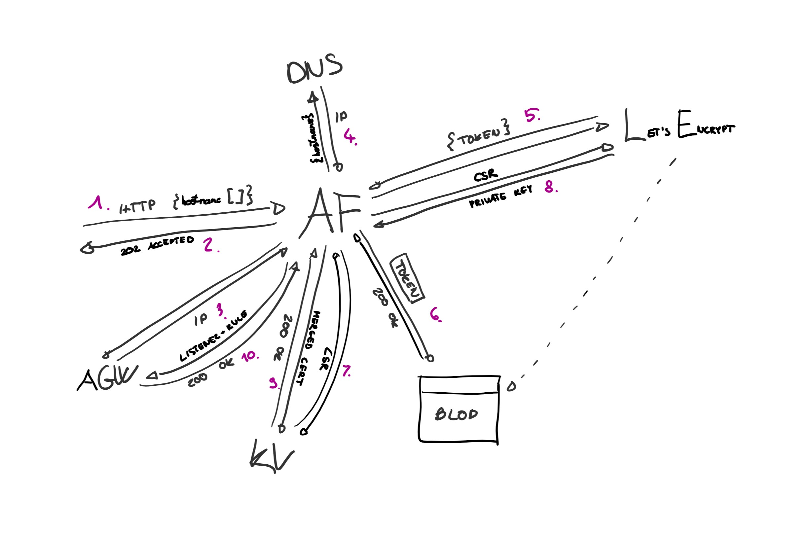

# Certbot - Certification request and renewal management Azure Function using the ACME protocol



## Architecture

1. The Orchestrator Function is triggered by an HTTP POST request contaning one or more hostnames.
2. The Orchestrator instantly replies with 202 Accepted and a link in the response body, where the status can be queried.
3. Query the public IP address of the Application Gateway, using the Azure REST API.
4. Check if the hostname received is resolving to the IP address of the Application Qateway. (Directly with an A record or through another hostname using a CNAME record.)
5. Start an ACME order with the ACME endpoint (aka. start the process with the CA).
    1. Start the process.
    2. Get the validation file.
6. Upload the validation file to Azure Blob Storage. (A path based rule should direct HTTP traffic there from the Application Gateway. Path: `/.well-known/acme-challenge/*`)
    1. Upload the file.
    2. Answer the ACME challenge (let the CA know thet the file is uploaded).
    3. Wait for the validation (the CA will check the file - this is async, so we regularly poll the CA if it is ready).
    4. Delete the validation file.
7. Create a new Certificate in Azure Key Vault and get the CSR (Certificate Signing Request).
8. Finalize the ACME order (send the CSR to the CA and get back a private key).
9. Merge the certificate created in Key Vault with the private key from the CA and upload this to Key Vault.
10. Configure the Application Gateway.
    1. Create a new HTTPS Listener with the newly created certificate in Key Vault.
    2. Create a Request Routing Rule to route traffic to the predefined (in [configuration](#configuration-parameters)) backend.

## Configuration parameters

- `AcmeEndpoint` - ACME endpoint (like `https://acme-v02.api.letsencrypt.org/`).
- `AcmeAccountEmail` - Account email to the ACME server.
- `TenantId` - Azure Tenant ID containing all the resources and the managed services identity.
- `SubscriptionId` - Azure Subscription ID containing all the resources.
- `ApplicationGatewayResourceGroup` - Name of the Resource Group containing the Application Gateway.
- `ApplicationGatewayName` - Name of the Application Gateway resource.
- `ApplicationGatewayHttpSettingsName` - Name of the HTTP Setting the new Request Routing Rules should use.
- `ApplicationGatewayBackendName` - Name of the Backend Pool where the new Request Routing Rule should route traffic to.
- `BlobContainerUrl` - Absolut URL of the container where the `/.well-known/acme-challenge/*` path is mapped in the Application Gateway.
- `KeyVaultBaseUrl` - Base URL of the Key Vault.

## Permissions

- Enable managed service identity (MSI) for the Azure Function.
- Assign the role `Contributor` **AND** `Storage Blob Data Contributor` to the Storage Account for the MSI.
- Assign the role `Contributor` to the Application Gateway for the MSI.
- Assign the role `Reader` to the Public IP Address of the Application Gateway for the MSI.
- The Application Gateway must have a user assigned managed identity and the following permissions to the Key Vault: `secret/get`, `secret/set`, `certificate/get`, `certificate/create`, `certificate/update`
- Assign the role `Contributor` **AND** `Managed Identity Operator` to the user assigned managed identity for the Function's managed service identity.

## Sample request

```http
POST /api/AddCertificateFunctions_HttpStart
Content-Type: application/json

{
    "Hostnames": [
        { "Hostname": "example.com" }
    ]
}
```
